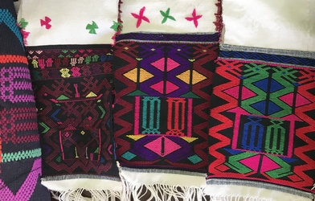

# Multi-CAST Jinghpaw

## How to cite

If you use these data please cite
- the original source
  > Kurabe, Keita. 2023. Multi-CAST Jinghpaw. In Haig, Geoffrey & Schnell, Stefan (eds.), Multi-CAST: Multilingual corpus of annotated spoken texts. Version 2311. Bamberg: University of Bamberg. (multicast.aspra.uni-bamberg.de/#jinghpaw) (date accessed)
- the derived dataset using the DOI of the [particular released version](../../releases/) you were using



## Description


**Jinghpaw** ([kach1280](https://glottolog.org/resource/languoid/id/kach1280)), also known as Kachin, is a Tibeto-Burman language spoken in northern Myanmar and neighbouring areas in India and the PR of China. The variety represented in the corpus is spoken in and around Myitkyina, Kachin State, Myanmar. The Jinghpaw speakers, as is typical for highlanders in mainland Southeast Asia, live in a socioculturally dynamic and multilingual environment. Jinghpaw serves as a lingua franca among the Kachin people, who speak diverse mutually unintelligible Tibeto-Burman languages, but have a number of shared cultural traits.

The Multi-CAST Jinghpaw corpus consists of traditional narratives glossed and annotated with GRAID by Keita Kurabe with the help of Stefan Schnell; annotations with RefIND were added by Ivan Kapitonov. They constitute a subset of more than 2 700 traditional Kachin narratives and related stories collected by Keita Kurabe and members from the Kachin community through a community-based documentation project undertaken in northern Myanmar between 2009 and 2020. Audio recordings for 2 754 stories are archived in two PARADISEC collections ([1](http://catalog.paradisec.org.au/collections/KK1), [2](http://catalog.paradisec.org.au/collections/KK2)). See [Kurabe (2016)](Source#cldf:kurabe2016) for a comprehensive grammar of the language.

This dataset is licensed under a CC-BY-4.0 license

Available online at https://multicast.aspra.uni-bamberg.de/#jinghpaw


```geojson
{
    "type": "FeatureCollection",
    "features": [
        {
            "type": "Feature",
            "geometry": {
                "type": "Point",
                "coordinates": [
                    97.3278,
                    25.4634
                ]
            }
        },
        {
            "type": "Feature",
            "geometry": {
                "type": "Polygon",
                "coordinates": [
                    [
                        [
                            92.3278,
                            30.4634
                        ],
                        [
                            102.3278,
                            30.4634
                        ],
                        [
                            102.3278,
                            20.4634
                        ],
                        [
                            92.3278,
                            20.4634
                        ],
                        [
                            92.3278,
                            30.4634
                        ]
                    ]
                ]
            }
        }
    ]
}
```


## Corpus counts

Only a small number of basic GRAID symbols are counted:

*Function symbols*
- ⟨0⟩ zero
- ⟨pro⟩ definite pronoun
- ⟨np⟩ full noun phrase
- ⟨other⟩ form not further specified

*Person/Animacy symbols*
- ⟨.1⟩ first person
- ⟨.2⟩ second person
- ⟨.h⟩ third person, human
- ⟨.d⟩ third person, anthropomorphic
- ø third person, non-human

*Function symbols*
- ⟨:s⟩ subject of an intransitive clause
- ⟨:a⟩ subject of a transitive clause
- ⟨:ncs⟩ non-canonical subject
- ⟨:p⟩ direct object
- ⟨:obl⟩ oblique argument
- ⟨:g⟩ goal argument
- ⟨:l⟩ locational argument
- ⟨:pred⟩ predicate
- ⟨:poss⟩ possessive
- ⟨:other⟩ function not further specified

Only basic categories are listed; categories represented by complex symbols with additional
specifiers (e.g. ⟨dem_pro⟩ ‘demonstrative pronoun’) have been subsumed under the more basic
category (e.g. ⟨pro⟩ ‘definite pronoun’). Please refer to the annotation notes for this corpus for
information on all annotated categories, including those not listed here.

| GRAID | ⟨:s⟩ | ⟨:a⟩ | ⟨:ncs⟩ | ⟨:p⟩ | ⟨:obl⟩ | ⟨:g⟩ | ⟨:l⟩ | ⟨:pred⟩ | ⟨:poss⟩ | ⟨:other⟩ | totals |
|:--------------|-------:|-------:|---------:|-------:|---------:|-------:|-------:|----------:|----------:|-----------:|---------:|
| **⟨0.1⟩** | 28 | 49 | 0 | 10 | 0 | 0 | 0 | 0 | 0 | 0 | 87 |
| **⟨0.2⟩** | 20 | 37 | 0 | 8 | 0 | 0 | 0 | 0 | 0 | 0 | 65 |
| **⟨0.h⟩** | 199 | 136 | 0 | 38 | 1 | 0 | 0 | 0 | 1 | 0 | 375 |
| **⟨0.d⟩** | 82 | 39 | 0 | 6 | 0 | 0 | 0 | 0 | 0 | 0 | 127 |
| **⟨0⟩** | 52 | 2 | 0 | 119 | 1 | 8 | 3 | 0 | 0 | 1 | 186 |
| **⟨pro.1⟩** | 25 | 36 | 0 | 14 | 1 | 0 | 0 | 0 | 27 | 0 | 103 |
| **⟨pro.2⟩** | 18 | 29 | 0 | 8 | 0 | 0 | 1 | 0 | 15 | 0 | 71 |
| **⟨pro.h⟩** | 74 | 67 | 0 | 15 | 0 | 0 | 0 | 0 | 37 | 0 | 193 |
| **⟨pro.d⟩** | 29 | 16 | 0 | 9 | 0 | 0 | 0 | 0 | 12 | 0 | 66 |
| **⟨pro⟩** | 21 | 1 | 0 | 26 | 17 | 3 | 32 | 3 | 1 | 61 | 165 |
| **⟨np.1⟩** | 0 | 1 | 0 | 0 | 0 | 0 | 0 | 0 | 0 | 0 | 1 |
| **⟨np.2⟩** | 0 | 0 | 0 | 0 | 0 | 0 | 0 | 0 | 0 | 0 | 0 |
| **⟨np.h⟩** | 76 | 56 | 0 | 49 | 11 | 2 | 0 | 19 | 15 | 3 | 231 |
| **⟨np.d⟩** | 28 | 16 | 0 | 6 | 1 | 0 | 0 | 2 | 3 | 1 | 57 |
| **⟨np⟩** | 91 | 4 | 0 | 208 | 24 | 68 | 58 | 35 | 3 | 149 | 640 |
| **⟨other.1⟩** | 0 | 0 | 0 | 0 | 0 | 0 | 0 | 0 | 0 | 0 | 0 |
| **⟨other.2⟩** | 0 | 0 | 0 | 0 | 0 | 0 | 0 | 0 | 0 | 0 | 0 |
| **⟨other.h⟩** | 0 | 0 | 0 | 0 | 0 | 0 | 0 | 0 | 0 | 0 | 0 |
| **⟨other.d⟩** | 0 | 0 | 0 | 0 | 0 | 0 | 0 | 0 | 0 | 0 | 0 |
| **⟨other⟩** | 0 | 0 | 0 | 0 | 0 | 0 | 0 | 14 | 0 | 0 | 14 |
| | 743 | 489 | 0 | 516 | 56 | 81 | 94 | 73 | 114 | 215 | 2381 |


**Clause boundaries**

| GRAID | count |
|:-----------|--------:|
| **⟨##⟩** | 1078 |
| **⟨#⟩** | 198 |
| **totals** | 1276 |


## Corpus metadata

- [Annotation notes](cldf/media/annotation-notes.pdf)
- [Translated texts](cldf/media/translated-texts.pdf)


## CLDF Datasets

The following CLDF datasets are available in [cldf](cldf):

- CLDF [TextCorpus](https://github.com/cldf/cldf/tree/master/modules/TextCorpus) at [cldf/TextCorpus-metadata.json](cldf/TextCorpus-metadata.json)